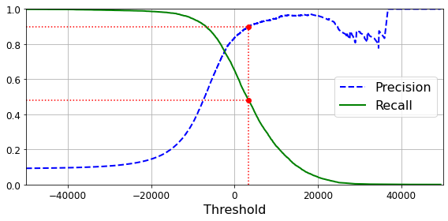
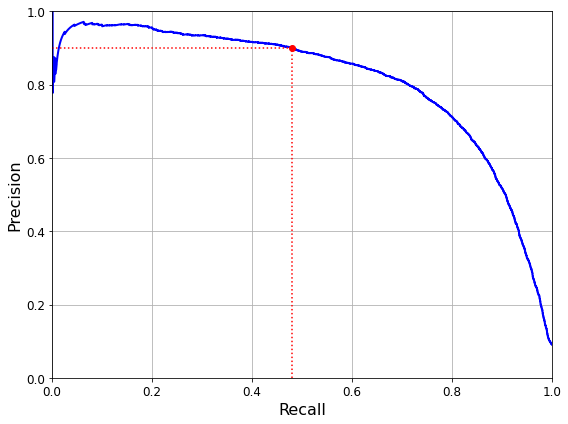
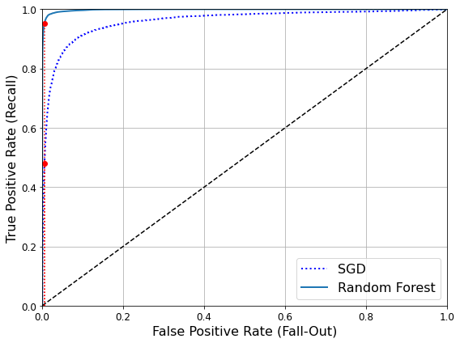
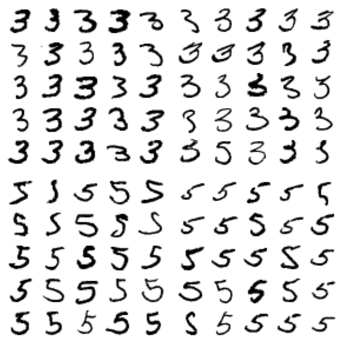
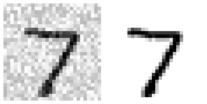
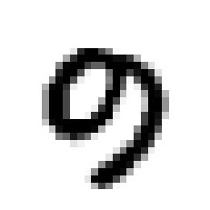
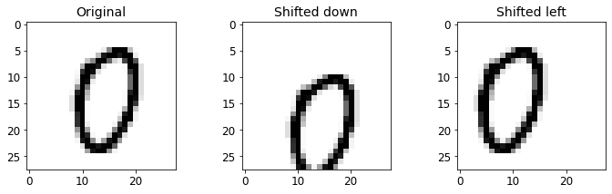

**Chapter 3 – Classification**

_This notebook contains all the sample code and solutions to the exercises in chapter 3._

<table align="left">
  <td>
    <a href="https://colab.research.google.com/github/ageron/handson-ml2/blob/master/03_classification.ipynb" target="_parent"></a>
  </td>
  <td>
    <a target="_blank" href="https://kaggle.com/kernels/welcome?src=https://github.com/ageron/handson-ml2/blob/add-kaggle-badge/03_classification.ipynb"></a>
  </td>
</table>

# Setup

First, let's import a few common modules, ensure MatplotLib plots figures inline and prepare a function to save the figures. We also check that Python 3.5 or later is installed (although Python 2.x may work, it is deprecated so we strongly recommend you use Python 3 instead), as well as Scikit-Learn ≥0.20.


```python
# Python ≥3.5 is required
import sys
assert sys.version_info >= (3, 5)

# Is this notebook running on Colab or Kaggle?
IS_COLAB = "google.colab" in sys.modules
IS_KAGGLE = "kaggle_secrets" in sys.modules

# Scikit-Learn ≥0.20 is required
import sklearn
assert sklearn.__version__ >= "0.20"

# Common imports
import numpy as np
import os

# to make this notebook's output stable across runs
np.random.seed(42)

# To plot pretty figures
%matplotlib inline
import matplotlib as mpl
import matplotlib.pyplot as plt
mpl.rc('axes', labelsize=14)
mpl.rc('xtick', labelsize=12)
mpl.rc('ytick', labelsize=12)

# Where to save the figures
PROJECT_ROOT_DIR = "."
CHAPTER_ID = "classification"
IMAGES_PATH = os.path.join(PROJECT_ROOT_DIR, "images", CHAPTER_ID)
os.makedirs(IMAGES_PATH, exist_ok=True)

def save_fig(fig_id, tight_layout=True, fig_extension="png", resolution=300):
    path = os.path.join(IMAGES_PATH, fig_id + "." + fig_extension)
    print("Saving figure", fig_id)
    if tight_layout:
        plt.tight_layout()
    plt.savefig(path, format=fig_extension, dpi=resolution)
```

# MNIST

**Warning:** since Scikit-Learn 0.24, `fetch_openml()` returns a Pandas `DataFrame` by default. To avoid this and keep the same code as in the book, we use `as_frame=False`.


```python
from sklearn.datasets import fetch_openml
mnist = fetch_openml('mnist_784', version=1, as_frame=False)
mnist.keys()
```


    dict_keys(['data', 'target', 'frame', 'categories', 'feature_names', 'target_names', 'DESCR', 'details', 'url'])


```python
X, y = mnist["data"], mnist["target"]
X.shape
```


    (70000, 784)


```python
y.shape
```


    (70000,)


```python
28 * 28
```


    784


```python
%matplotlib inline
import matplotlib as mpl
import matplotlib.pyplot as plt

some_digit = X[0]
some_digit_image = some_digit.reshape(28, 28)
plt.imshow(some_digit_image, cmap=mpl.cm.binary)
plt.axis("off")

save_fig("some_digit_plot")
plt.show()
```

    Saving figure some_digit_plot


    

    


```python
y[0]
```


    '5'


```python
y = y.astype(np.uint8)
```


```python
def plot_digit(data):
    image = data.reshape(28, 28)
    plt.imshow(image, cmap = mpl.cm.binary,
               interpolation="nearest")
    plt.axis("off")
```


```python
# EXTRA
def plot_digits(instances, images_per_row=10, **options):
    size = 28
    images_per_row = min(len(instances), images_per_row)
    images = [instance.reshape(size,size) for instance in instances]
    n_rows = (len(instances) - 1) // images_per_row + 1
    row_images = []
    n_empty = n_rows * images_per_row - len(instances)
    images.append(np.zeros((size, size * n_empty)))
    for row in range(n_rows):
        rimages = images[row * images_per_row : (row + 1) * images_per_row]
        row_images.append(np.concatenate(rimages, axis=1))
    image = np.concatenate(row_images, axis=0)
    plt.imshow(image, cmap = mpl.cm.binary, **options)
    plt.axis("off")
```


```python
plt.figure(figsize=(9,9))
example_images = X[:100]
plot_digits(example_images, images_per_row=10)
save_fig("more_digits_plot")
plt.show()
```

    Saving figure more_digits_plot


    

    


```python
y[0]

```


    5


```python
X_train, X_test, y_train, y_test = X[:60000], X[60000:], y[:60000], y[60000:]

```

# Binary classifier


```python
y_train_5 = (y_train == 5)
y_test_5 = (y_test == 5)
```

**Note**: some hyperparameters will have a different defaut value in future versions of Scikit-Learn, such as `max_iter` and `tol`. To be future-proof, we explicitly set these hyperparameters to their future default values. For simplicity, this is not shown in the book.


```python
from sklearn.linear_model import SGDClassifier

sgd_clf = SGDClassifier(max_iter=1000, tol=1e-3, random_state=42)
sgd_clf.fit(X_train, y_train_5)
```


    SGDClassifier(random_state=42)


```python
sgd_clf.predict([some_digit])
```


    array([ True])


```python
from sklearn.model_selection import cross_val_score
cross_val_score(sgd_clf, X_train, y_train_5, cv=3, scoring="accuracy")
```


    array([0.95035, 0.96035, 0.9604 ])


```python
from sklearn.model_selection import StratifiedKFold
from sklearn.base import clone

skfolds = StratifiedKFold(n_splits=3, shuffle=True, random_state=42)

for train_index, test_index in skfolds.split(X_train, y_train_5):
    clone_clf = clone(sgd_clf)
    X_train_folds = X_train[train_index]
    y_train_folds = y_train_5[train_index]
    X_test_fold = X_train[test_index]
    y_test_fold = y_train_5[test_index]

    clone_clf.fit(X_train_folds, y_train_folds)
    y_pred = clone_clf.predict(X_test_fold)
    n_correct = sum(y_pred == y_test_fold)
    print(n_correct / len(y_pred))
```

    0.9669
    0.91625
    0.96785


**Note**: `shuffle=True` was omitted by mistake in previous releases of the book.


```python
from sklearn.base import BaseEstimator
class Never5Classifier(BaseEstimator):
    def fit(self, X, y=None):
        pass
    def predict(self, X):
        return np.zeros((len(X), 1), dtype=bool)
```


```python
never_5_clf = Never5Classifier()
cross_val_score(never_5_clf, X_train, y_train_5, cv=3, scoring="accuracy")
```


    array([0.91125, 0.90855, 0.90915])


**Warning**: this output (and many others in this notebook and other notebooks) may differ slightly from those in the book. Don't worry, that's okay! There are several reasons for this:
* first, Scikit-Learn and other libraries evolve, and algorithms get tweaked a bit, which may change the exact result you get. If you use the latest Scikit-Learn version (and in general, you really should), you probably won't be using the exact same version I used when I wrote the book or this notebook, hence the difference. I try to keep this notebook reasonably up to date, but I can't change the numbers on the pages in your copy of the book.
* second, many training algorithms are stochastic, meaning they rely on randomness. In principle, it's possible to get consistent outputs from a random number generator by setting the seed from which it generates the pseudo-random numbers (which is why you will see `random_state=42` or `np.random.seed(42)` pretty often). However, sometimes this does not suffice due to the other factors listed here.
* third, if the training algorithm runs across multiple threads (as do some algorithms implemented in C) or across multiple processes (e.g., when using the `n_jobs` argument), then the precise order in which operations will run is not always guaranteed, and thus the exact result may vary slightly.
* lastly, other things may prevent perfect reproducibility, such as Python dicts and sets whose order is not guaranteed to be stable across sessions, or the order of files in a directory which is also not guaranteed.


```python
from sklearn.model_selection import cross_val_predict

y_train_pred = cross_val_predict(sgd_clf, X_train, y_train_5, cv=3)
```


```python
from sklearn.metrics import confusion_matrix

confusion_matrix(y_train_5, y_train_pred)
```


    array([[53892,   687],
           [ 1891,  3530]])


```python
y_train_perfect_predictions = y_train_5  # pretend we reached perfection
confusion_matrix(y_train_5, y_train_perfect_predictions)
```


    array([[54579,     0],
           [    0,  5421]])


```python
from sklearn.metrics import precision_score, recall_score

precision_score(y_train_5, y_train_pred)
```


    0.8370879772350012


```python
cm = confusion_matrix(y_train_5, y_train_pred)
cm[1, 1] / (cm[0, 1] + cm[1, 1])
```


    0.8370879772350012


```python
recall_score(y_train_5, y_train_pred)
```


    0.6511713705958311


```python
cm[1, 1] / (cm[1, 0] + cm[1, 1])
```


    0.6511713705958311


```python
from sklearn.metrics import f1_score

f1_score(y_train_5, y_train_pred)
```


    0.7325171197343846


```python
cm[1, 1] / (cm[1, 1] + (cm[1, 0] + cm[0, 1]) / 2)
```


    0.7325171197343847


```python
y_scores = sgd_clf.decision_function([some_digit])
y_scores
```


    array([2164.22030239])


```python
threshold = 0
y_some_digit_pred = (y_scores > threshold)
```


```python
y_some_digit_pred
```


    array([ True])


```python
threshold = 8000
y_some_digit_pred = (y_scores > threshold)
y_some_digit_pred
```


    array([False])


```python
y_scores = cross_val_predict(sgd_clf, X_train, y_train_5, cv=3,
                             method="decision_function")
```


```python
from sklearn.metrics import precision_recall_curve

precisions, recalls, thresholds = precision_recall_curve(y_train_5, y_scores)
```


```python
def plot_precision_recall_vs_threshold(precisions, recalls, thresholds):
    plt.plot(thresholds, precisions[:-1], "b--", label="Precision", linewidth=2)
    plt.plot(thresholds, recalls[:-1], "g-", label="Recall", linewidth=2)
    plt.legend(loc="center right", fontsize=16) # Not shown in the book
    plt.xlabel("Threshold", fontsize=16)        # Not shown
    plt.grid(True)                              # Not shown
    plt.axis([-50000, 50000, 0, 1])             # Not shown


recall_90_precision = recalls[np.argmax(precisions >= 0.90)]
threshold_90_precision = thresholds[np.argmax(precisions >= 0.90)]


plt.figure(figsize=(8, 4))                                                                  # Not shown
plot_precision_recall_vs_threshold(precisions, recalls, thresholds)
plt.plot([threshold_90_precision, threshold_90_precision], [0., 0.9], "r:")                 # Not shown
plt.plot([-50000, threshold_90_precision], [0.9, 0.9], "r:")                                # Not shown
plt.plot([-50000, threshold_90_precision], [recall_90_precision, recall_90_precision], "r:")# Not shown
plt.plot([threshold_90_precision], [0.9], "ro")                                             # Not shown
plt.plot([threshold_90_precision], [recall_90_precision], "ro")                             # Not shown
save_fig("precision_recall_vs_threshold_plot")                                              # Not shown
plt.show()
```

    Saving figure precision_recall_vs_threshold_plot


    

    


```python
(y_train_pred == (y_scores > 0)).all()
```


    True


```python
def plot_precision_vs_recall(precisions, recalls):
    plt.plot(recalls, precisions, "b-", linewidth=2)
    plt.xlabel("Recall", fontsize=16)
    plt.ylabel("Precision", fontsize=16)
    plt.axis([0, 1, 0, 1])
    plt.grid(True)

plt.figure(figsize=(8, 6))
plot_precision_vs_recall(precisions, recalls)
plt.plot([recall_90_precision, recall_90_precision], [0., 0.9], "r:")
plt.plot([0.0, recall_90_precision], [0.9, 0.9], "r:")
plt.plot([recall_90_precision], [0.9], "ro")
save_fig("precision_vs_recall_plot")
plt.show()
```

    Saving figure precision_vs_recall_plot


    

    


```python
threshold_90_precision = thresholds[np.argmax(precisions >= 0.90)]
```


```python
threshold_90_precision
```


    3370.0194991439557


```python
y_train_pred_90 = (y_scores >= threshold_90_precision)
```


```python
precision_score(y_train_5, y_train_pred_90)
```


    0.9000345901072293


```python
recall_score(y_train_5, y_train_pred_90)
```


    0.4799852425751706


# ROC curves


```python
from sklearn.metrics import roc_curve

fpr, tpr, thresholds = roc_curve(y_train_5, y_scores)
```


```python
def plot_roc_curve(fpr, tpr, label=None):
    plt.plot(fpr, tpr, linewidth=2, label=label)
    plt.plot([0, 1], [0, 1], 'k--') # dashed diagonal
    plt.axis([0, 1, 0, 1])                                    # Not shown in the book
    plt.xlabel('False Positive Rate (Fall-Out)', fontsize=16) # Not shown
    plt.ylabel('True Positive Rate (Recall)', fontsize=16)    # Not shown
    plt.grid(True)                                            # Not shown

plt.figure(figsize=(8, 6))                                    # Not shown
plot_roc_curve(fpr, tpr)
fpr_90 = fpr[np.argmax(tpr >= recall_90_precision)]           # Not shown
plt.plot([fpr_90, fpr_90], [0., recall_90_precision], "r:")   # Not shown
plt.plot([0.0, fpr_90], [recall_90_precision, recall_90_precision], "r:")  # Not shown
plt.plot([fpr_90], [recall_90_precision], "ro")               # Not shown
save_fig("roc_curve_plot")                                    # Not shown
plt.show()
```

    Saving figure roc_curve_plot


    

    


```python
from sklearn.metrics import roc_auc_score

roc_auc_score(y_train_5, y_scores)
```


    0.9604938554008616


**Note**: we set `n_estimators=100` to be future-proof since this will be the default value in Scikit-Learn 0.22.


```python
from sklearn.ensemble import RandomForestClassifier
forest_clf = RandomForestClassifier(n_estimators=100, random_state=42)
y_probas_forest = cross_val_predict(forest_clf, X_train, y_train_5, cv=3,
                                    method="predict_proba")
```


```python
y_scores_forest = y_probas_forest[:, 1] # score = proba of positive class
fpr_forest, tpr_forest, thresholds_forest = roc_curve(y_train_5,y_scores_forest)
```


```python
recall_for_forest = tpr_forest[np.argmax(fpr_forest >= fpr_90)]

plt.figure(figsize=(8, 6))
plt.plot(fpr, tpr, "b:", linewidth=2, label="SGD")
plot_roc_curve(fpr_forest, tpr_forest, "Random Forest")
plt.plot([fpr_90, fpr_90], [0., recall_90_precision], "r:")
plt.plot([0.0, fpr_90], [recall_90_precision, recall_90_precision], "r:")
plt.plot([fpr_90], [recall_90_precision], "ro")
plt.plot([fpr_90, fpr_90], [0., recall_for_forest], "r:")
plt.plot([fpr_90], [recall_for_forest], "ro")
plt.grid(True)
plt.legend(loc="lower right", fontsize=16)
save_fig("roc_curve_comparison_plot")
plt.show()
```

    Saving figure roc_curve_comparison_plot


    

    


```python
roc_auc_score(y_train_5, y_scores_forest)
```


    0.9983436731328145


```python
y_train_pred_forest = cross_val_predict(forest_clf, X_train, y_train_5, cv=3)
precision_score(y_train_5, y_train_pred_forest)
```


    0.9905083315756169


```python
recall_score(y_train_5, y_train_pred_forest)
```


    0.8662608374838591


# Multiclass classification


```python
from sklearn.svm import SVC

svm_clf = SVC(gamma="auto", random_state=42)
svm_clf.fit(X_train[:1000], y_train[:1000]) # y_train, not y_train_5
svm_clf.predict([some_digit])
```


    array([5], dtype=uint8)


```python
some_digit_scores = svm_clf.decision_function([some_digit])
some_digit_scores
```


    array([[ 2.81585438,  7.09167958,  3.82972099,  0.79365551,  5.8885703 ,
             9.29718395,  1.79862509,  8.10392157, -0.228207  ,  4.83753243]])


```python
np.argmax(some_digit_scores)
```


    5


```python
svm_clf.classes_
```


    array([0, 1, 2, 3, 4, 5, 6, 7, 8, 9], dtype=uint8)


```python
svm_clf.classes_[5]
```


    5


```python
from sklearn.multiclass import OneVsRestClassifier
ovr_clf = OneVsRestClassifier(SVC(gamma="auto", random_state=42))
ovr_clf.fit(X_train[:1000], y_train[:1000])
ovr_clf.predict([some_digit])
```


    array([5], dtype=uint8)


```python
len(ovr_clf.estimators_)
```


    10


```python
sgd_clf.fit(X_train, y_train)
sgd_clf.predict([some_digit])
```


    array([3], dtype=uint8)


```python
sgd_clf.decision_function([some_digit])
```


    array([[-31893.03095419, -34419.69069632,  -9530.63950739,
              1823.73154031, -22320.14822878,  -1385.80478895,
            -26188.91070951, -16147.51323997,  -4604.35491274,
            -12050.767298  ]])


**Warning**: the following two cells may take close to 30 minutes to run, or more depending on your hardware.


```python
cross_val_score(sgd_clf, X_train, y_train, cv=3, scoring="accuracy")
```


    array([0.87365, 0.85835, 0.8689 ])


```python
from sklearn.preprocessing import StandardScaler
scaler = StandardScaler()
X_train_scaled = scaler.fit_transform(X_train.astype(np.float64))
cross_val_score(sgd_clf, X_train_scaled, y_train, cv=3, scoring="accuracy")
```


    array([0.8983, 0.891 , 0.9018])


# Error analysis


```python
y_train_pred = cross_val_predict(sgd_clf, X_train_scaled, y_train, cv=3)
conf_mx = confusion_matrix(y_train, y_train_pred)
conf_mx
```


    array([[5577,    0,   22,    5,    8,   43,   36,    6,  225,    1],
           [   0, 6400,   37,   24,    4,   44,    4,    7,  212,   10],
           [  27,   27, 5220,   92,   73,   27,   67,   36,  378,   11],
           [  22,   17,  117, 5227,    2,  203,   27,   40,  403,   73],
           [  12,   14,   41,    9, 5182,   12,   34,   27,  347,  164],
           [  27,   15,   30,  168,   53, 4444,   75,   14,  535,   60],
           [  30,   15,   42,    3,   44,   97, 5552,    3,  131,    1],
           [  21,   10,   51,   30,   49,   12,    3, 5684,  195,  210],
           [  17,   63,   48,   86,    3,  126,   25,   10, 5429,   44],
           [  25,   18,   30,   64,  118,   36,    1,  179,  371, 5107]])


```python
# since sklearn 0.22, you can use sklearn.metrics.plot_confusion_matrix()
def plot_confusion_matrix(matrix):
    """If you prefer color and a colorbar"""
    fig = plt.figure(figsize=(8,8))
    ax = fig.add_subplot(111)
    cax = ax.matshow(matrix)
    fig.colorbar(cax)
```


```python
plt.matshow(conf_mx, cmap=plt.cm.gray)
save_fig("confusion_matrix_plot", tight_layout=False)
plt.show()
```

    Saving figure confusion_matrix_plot


    

    


```python
row_sums = conf_mx.sum(axis=1, keepdims=True)
norm_conf_mx = conf_mx / row_sums
```


```python
np.fill_diagonal(norm_conf_mx, 0)
plt.matshow(norm_conf_mx, cmap=plt.cm.gray)
save_fig("confusion_matrix_errors_plot", tight_layout=False)
plt.show()
```

    Saving figure confusion_matrix_errors_plot


    

    


```python
cl_a, cl_b = 3, 5
X_aa = X_train[(y_train == cl_a) & (y_train_pred == cl_a)]
X_ab = X_train[(y_train == cl_a) & (y_train_pred == cl_b)]
X_ba = X_train[(y_train == cl_b) & (y_train_pred == cl_a)]
X_bb = X_train[(y_train == cl_b) & (y_train_pred == cl_b)]

plt.figure(figsize=(8,8))
plt.subplot(221); plot_digits(X_aa[:25], images_per_row=5)
plt.subplot(222); plot_digits(X_ab[:25], images_per_row=5)
plt.subplot(223); plot_digits(X_ba[:25], images_per_row=5)
plt.subplot(224); plot_digits(X_bb[:25], images_per_row=5)
save_fig("error_analysis_digits_plot")
plt.show()
```

    Saving figure error_analysis_digits_plot


    

    


# Multilabel classification


```python
from sklearn.neighbors import KNeighborsClassifier

y_train_large = (y_train >= 7)
y_train_odd = (y_train % 2 == 1)
y_multilabel = np.c_[y_train_large, y_train_odd]

knn_clf = KNeighborsClassifier()
knn_clf.fit(X_train, y_multilabel)
```


    KNeighborsClassifier()


```python
knn_clf.predict([some_digit])
```


    array([[False,  True]])


**Warning**: the following cell may take a very long time (possibly hours depending on your hardware).


```python
y_train_knn_pred = cross_val_predict(knn_clf, X_train, y_multilabel, cv=3)
f1_score(y_multilabel, y_train_knn_pred, average="macro")
```


    0.976410265560605


# Multioutput classification


```python
noise = np.random.randint(0, 100, (len(X_train), 784))
X_train_mod = X_train + noise
noise = np.random.randint(0, 100, (len(X_test), 784))
X_test_mod = X_test + noise
y_train_mod = X_train
y_test_mod = X_test
```


```python
some_index = 0
plt.subplot(121); plot_digit(X_test_mod[some_index])
plt.subplot(122); plot_digit(y_test_mod[some_index])
save_fig("noisy_digit_example_plot")
plt.show()
```

    Saving figure noisy_digit_example_plot


    

    


```python
knn_clf.fit(X_train_mod, y_train_mod)
clean_digit = knn_clf.predict([X_test_mod[some_index]])
plot_digit(clean_digit)
save_fig("cleaned_digit_example_plot")
```

    Saving figure cleaned_digit_example_plot


    

    


# Extra material

## Dummy (ie. random) classifier


```python
from sklearn.dummy import DummyClassifier
dmy_clf = DummyClassifier(strategy="prior")
y_probas_dmy = cross_val_predict(dmy_clf, X_train, y_train_5, cv=3, method="predict_proba")
y_scores_dmy = y_probas_dmy[:, 1]
```


```python
fprr, tprr, thresholdsr = roc_curve(y_train_5, y_scores_dmy)
plot_roc_curve(fprr, tprr)
```


    

    


## KNN classifier


```python
from sklearn.neighbors import KNeighborsClassifier
knn_clf = KNeighborsClassifier(weights='distance', n_neighbors=4)
knn_clf.fit(X_train, y_train)
```


    KNeighborsClassifier(n_neighbors=4, weights='distance')


```python
y_knn_pred = knn_clf.predict(X_test)
```


```python
from sklearn.metrics import accuracy_score
accuracy_score(y_test, y_knn_pred)
```


    0.9714


```python
from scipy.ndimage.interpolation import shift
def shift_digit(digit_array, dx, dy, new=0):
    return shift(digit_array.reshape(28, 28), [dy, dx], cval=new).reshape(784)

plot_digit(shift_digit(some_digit, 5, 1, new=100))
```


    

    


```python
X_train_expanded = [X_train]
y_train_expanded = [y_train]
for dx, dy in ((1, 0), (-1, 0), (0, 1), (0, -1)):
    shifted_images = np.apply_along_axis(shift_digit, axis=1, arr=X_train, dx=dx, dy=dy)
    X_train_expanded.append(shifted_images)
    y_train_expanded.append(y_train)

X_train_expanded = np.concatenate(X_train_expanded)
y_train_expanded = np.concatenate(y_train_expanded)
X_train_expanded.shape, y_train_expanded.shape
```


    ((300000, 784), (300000,))


```python
knn_clf.fit(X_train_expanded, y_train_expanded)
```


    KNeighborsClassifier(n_neighbors=4, weights='distance')


```python
y_knn_expanded_pred = knn_clf.predict(X_test)
```


```python
accuracy_score(y_test, y_knn_expanded_pred)
```


    0.9763


```python
ambiguous_digit = X_test[2589]
knn_clf.predict_proba([ambiguous_digit])
```


    array([[0.24579675, 0.        , 0.        , 0.        , 0.        ,
            0.        , 0.        , 0.        , 0.        , 0.75420325]])


```python
plot_digit(ambiguous_digit)
```


    

    


# Exercise solutions

## 1. An MNIST Classifier With Over 97% Accuracy

**Warning**: the next cell may take close to 16 hours to run, or more depending on your hardware.


```python
from sklearn.model_selection import GridSearchCV

param_grid = [{'weights': ["uniform", "distance"], 'n_neighbors': [3, 4, 5]}]

knn_clf = KNeighborsClassifier()
grid_search = GridSearchCV(knn_clf, param_grid, cv=5, verbose=3)
grid_search.fit(X_train, y_train)
```

    Fitting 5 folds for each of 6 candidates, totalling 30 fits
    [CV] n_neighbors=3, weights=uniform ..................................


    [Parallel(n_jobs=1)]: Using backend SequentialBackend with 1 concurrent workers.


    [CV] ..... n_neighbors=3, weights=uniform, score=0.972, total=168.0min
    [CV] n_neighbors=3, weights=uniform ..................................


    [Parallel(n_jobs=1)]: Done   1 out of   1 | elapsed: 168.0min remaining:    0.0s


    [CV] ...... n_neighbors=3, weights=uniform, score=0.971, total=12.3min
    [CV] n_neighbors=3, weights=uniform ..................................


    [Parallel(n_jobs=1)]: Done   2 out of   2 | elapsed: 180.3min remaining:    0.0s


    [CV] ...... n_neighbors=3, weights=uniform, score=0.969, total=11.9min
    [CV] n_neighbors=3, weights=uniform ..................................
    [CV] ...... n_neighbors=3, weights=uniform, score=0.969, total=12.5min
    [CV] n_neighbors=3, weights=uniform ..................................
    [CV] ...... n_neighbors=3, weights=uniform, score=0.970, total=12.7min
    [CV] n_neighbors=3, weights=distance .................................
    [CV] ..... n_neighbors=3, weights=distance, score=0.972, total=12.5min
    [CV] n_neighbors=3, weights=distance .................................
    [CV] ..... n_neighbors=3, weights=distance, score=0.972, total=12.8min
    [CV] n_neighbors=3, weights=distance .................................
    [CV] ..... n_neighbors=3, weights=distance, score=0.970, total=12.6min
    [CV] n_neighbors=3, weights=distance .................................
    [CV] ..... n_neighbors=3, weights=distance, score=0.970, total=12.9min
    [CV] n_neighbors=3, weights=distance .................................
    [CV] ..... n_neighbors=3, weights=distance, score=0.971, total=11.3min
    [CV] n_neighbors=4, weights=uniform ..................................
    [CV] ...... n_neighbors=4, weights=uniform, score=0.969, total=11.0min
    [CV] n_neighbors=4, weights=uniform ..................................
    [CV] ...... n_neighbors=4, weights=uniform, score=0.968, total=11.0min
    [CV] n_neighbors=4, weights=uniform ..................................
    [CV] ...... n_neighbors=4, weights=uniform, score=0.968, total=11.0min
    [CV] n_neighbors=4, weights=uniform ..................................
    [CV] ...... n_neighbors=4, weights=uniform, score=0.967, total=11.0min
    [CV] n_neighbors=4, weights=uniform ..................................
    [CV] ...... n_neighbors=4, weights=uniform, score=0.970, total=11.0min
    [CV] n_neighbors=4, weights=distance .................................
    [CV] ..... n_neighbors=4, weights=distance, score=0.973, total=11.0min
    [CV] n_neighbors=4, weights=distance .................................
    [CV] ..... n_neighbors=4, weights=distance, score=0.972, total=11.0min
    [CV] n_neighbors=4, weights=distance .................................
    [CV] ..... n_neighbors=4, weights=distance, score=0.970, total=11.0min
    [CV] n_neighbors=4, weights=distance .................................
    [CV] ..... n_neighbors=4, weights=distance, score=0.971, total=11.0min
    [CV] n_neighbors=4, weights=distance .................................
    [CV] ..... n_neighbors=4, weights=distance, score=0.972, total=11.3min
    [CV] n_neighbors=5, weights=uniform ..................................
    [CV] ...... n_neighbors=5, weights=uniform, score=0.970, total=10.9min
    [CV] n_neighbors=5, weights=uniform ..................................
    [CV] ...... n_neighbors=5, weights=uniform, score=0.970, total=11.0min
    [CV] n_neighbors=5, weights=uniform ..................................
    [CV] ...... n_neighbors=5, weights=uniform, score=0.969, total=11.0min
    [CV] n_neighbors=5, weights=uniform ..................................
    [CV] ...... n_neighbors=5, weights=uniform, score=0.968, total=11.1min
    [CV] n_neighbors=5, weights=uniform ..................................
    [CV] ...... n_neighbors=5, weights=uniform, score=0.969, total=11.0min
    [CV] n_neighbors=5, weights=distance .................................
    [CV] ..... n_neighbors=5, weights=distance, score=0.970, total=93.6min
    [CV] n_neighbors=5, weights=distance .................................
    [CV] ..... n_neighbors=5, weights=distance, score=0.971, total=11.0min
    [CV] n_neighbors=5, weights=distance .................................
    [CV] ..... n_neighbors=5, weights=distance, score=0.970, total=10.9min
    [CV] n_neighbors=5, weights=distance .................................
    [CV] ..... n_neighbors=5, weights=distance, score=0.969, total=11.2min
    [CV] n_neighbors=5, weights=distance .................................
    [CV] ..... n_neighbors=5, weights=distance, score=0.971, total=11.1min


    [Parallel(n_jobs=1)]: Done  30 out of  30 | elapsed: 582.5min finished


    GridSearchCV(cv=5, estimator=KNeighborsClassifier(),
                 param_grid=[{'n_neighbors': [3, 4, 5],
                              'weights': ['uniform', 'distance']}],
                 verbose=3)


```python
grid_search.best_params_
```


    {'n_neighbors': 4, 'weights': 'distance'}


```python
grid_search.best_score_
```


    0.9716166666666666


```python
from sklearn.metrics import accuracy_score

y_pred = grid_search.predict(X_test)
accuracy_score(y_test, y_pred)
```


    0.9714


## 2. Data Augmentation


```python
from scipy.ndimage.interpolation import shift
```


```python
def shift_image(image, dx, dy):
    image = image.reshape((28, 28))
    shifted_image = shift(image, [dy, dx], cval=0, mode="constant")
    return shifted_image.reshape([-1])
```


```python
image = X_train[1000]
shifted_image_down = shift_image(image, 0, 5)
shifted_image_left = shift_image(image, -5, 0)

plt.figure(figsize=(12,3))
plt.subplot(131)
plt.title("Original", fontsize=14)
plt.imshow(image.reshape(28, 28), interpolation="nearest", cmap="Greys")
plt.subplot(132)
plt.title("Shifted down", fontsize=14)
plt.imshow(shifted_image_down.reshape(28, 28), interpolation="nearest", cmap="Greys")
plt.subplot(133)
plt.title("Shifted left", fontsize=14)
plt.imshow(shifted_image_left.reshape(28, 28), interpolation="nearest", cmap="Greys")
plt.show()
```


    

    


```python
X_train_augmented = [image for image in X_train]
y_train_augmented = [label for label in y_train]

for dx, dy in ((1, 0), (-1, 0), (0, 1), (0, -1)):
    for image, label in zip(X_train, y_train):
        X_train_augmented.append(shift_image(image, dx, dy))
        y_train_augmented.append(label)

X_train_augmented = np.array(X_train_augmented)
y_train_augmented = np.array(y_train_augmented)
```


```python
shuffle_idx = np.random.permutation(len(X_train_augmented))
X_train_augmented = X_train_augmented[shuffle_idx]
y_train_augmented = y_train_augmented[shuffle_idx]
```


```python
knn_clf = KNeighborsClassifier(**grid_search.best_params_)
```


```python
knn_clf.fit(X_train_augmented, y_train_augmented)
```


    KNeighborsClassifier(n_neighbors=4, weights='distance')


**Warning**: the following cell may take close to an hour to run, depending on your hardware.


```python
y_pred = knn_clf.predict(X_test)
accuracy_score(y_test, y_pred)
```


    0.9763


By simply augmenting the data, we got a 0.5% accuracy boost. :)

## 3. Tackle the Titanic dataset

The goal is to predict whether or not a passenger survived based on attributes such as their age, sex, passenger class, where they embarked and so on.

First, login to [Kaggle](https://www.kaggle.com/) and go to the [Titanic challenge](https://www.kaggle.com/c/titanic) to download `train.csv` and `test.csv`. Save them to the `datasets/titanic` directory.

Next, let's load the data:


```python
import os

TITANIC_PATH = os.path.join("datasets", "titanic")
```


```python
import pandas as pd

def load_titanic_data(filename, titanic_path=TITANIC_PATH):
    csv_path = os.path.join(titanic_path, filename)
    return pd.read_csv(csv_path)
```


```python
train_data = load_titanic_data("train.csv")
test_data = load_titanic_data("test.csv")
```

The data is already split into a training set and a test set. However, the test data does *not* contain the labels: your goal is to train the best model you can using the training data, then make your predictions on the test data and upload them to Kaggle to see your final score.

Let's take a peek at the top few rows of the training set:


```python
train_data.head()
```


<div>
<style scoped>
    .dataframe tbody tr th:only-of-type {
        vertical-align: middle;
    }

    .dataframe tbody tr th {
        vertical-align: top;
    }

    .dataframe thead th {
        text-align: right;
    }
</style>
<table border="1" class="dataframe">
  <thead>
    <tr style="text-align: right;">
      <th></th>
      <th>PassengerId</th>
      <th>Survived</th>
      <th>Pclass</th>
      <th>Name</th>
      <th>Sex</th>
      <th>Age</th>
      <th>SibSp</th>
      <th>Parch</th>
      <th>Ticket</th>
      <th>Fare</th>
      <th>Cabin</th>
      <th>Embarked</th>
    </tr>
  </thead>
  <tbody>
    <tr>
      <th>0</th>
      <td>1</td>
      <td>0</td>
      <td>3</td>
      <td>Braund, Mr. Owen Harris</td>
      <td>male</td>
      <td>22.0</td>
      <td>1</td>
      <td>0</td>
      <td>A/5 21171</td>
      <td>7.2500</td>
      <td>NaN</td>
      <td>S</td>
    </tr>
    <tr>
      <th>1</th>
      <td>2</td>
      <td>1</td>
      <td>1</td>
      <td>Cumings, Mrs. John Bradley (Florence Briggs Th...</td>
      <td>female</td>
      <td>38.0</td>
      <td>1</td>
      <td>0</td>
      <td>PC 17599</td>
      <td>71.2833</td>
      <td>C85</td>
      <td>C</td>
    </tr>
    <tr>
      <th>2</th>
      <td>3</td>
      <td>1</td>
      <td>3</td>
      <td>Heikkinen, Miss. Laina</td>
      <td>female</td>
      <td>26.0</td>
      <td>0</td>
      <td>0</td>
      <td>STON/O2. 3101282</td>
      <td>7.9250</td>
      <td>NaN</td>
      <td>S</td>
    </tr>
    <tr>
      <th>3</th>
      <td>4</td>
      <td>1</td>
      <td>1</td>
      <td>Futrelle, Mrs. Jacques Heath (Lily May Peel)</td>
      <td>female</td>
      <td>35.0</td>
      <td>1</td>
      <td>0</td>
      <td>113803</td>
      <td>53.1000</td>
      <td>C123</td>
      <td>S</td>
    </tr>
    <tr>
      <th>4</th>
      <td>5</td>
      <td>0</td>
      <td>3</td>
      <td>Allen, Mr. William Henry</td>
      <td>male</td>
      <td>35.0</td>
      <td>0</td>
      <td>0</td>
      <td>373450</td>
      <td>8.0500</td>
      <td>NaN</td>
      <td>S</td>
    </tr>
  </tbody>
</table>
</div>


The attributes have the following meaning:
* **Survived**: that's the target, 0 means the passenger did not survive, while 1 means he/she survived.
* **Pclass**: passenger class.
* **Name**, **Sex**, **Age**: self-explanatory
* **SibSp**: how many siblings & spouses of the passenger aboard the Titanic.
* **Parch**: how many children & parents of the passenger aboard the Titanic.
* **Ticket**: ticket id
* **Fare**: price paid (in pounds)
* **Cabin**: passenger's cabin number
* **Embarked**: where the passenger embarked the Titanic

Let's get more info to see how much data is missing:


```python
train_data.info()
```

    <class 'pandas.core.frame.DataFrame'>
    RangeIndex: 891 entries, 0 to 890
    Data columns (total 12 columns):
     #   Column       Non-Null Count  Dtype  
    ---  ------       --------------  -----  
     0   PassengerId  891 non-null    int64  
     1   Survived     891 non-null    int64  
     2   Pclass       891 non-null    int64  
     3   Name         891 non-null    object 
     4   Sex          891 non-null    object 
     5   Age          714 non-null    float64
     6   SibSp        891 non-null    int64  
     7   Parch        891 non-null    int64  
     8   Ticket       891 non-null    object 
     9   Fare         891 non-null    float64
     10  Cabin        204 non-null    object 
     11  Embarked     889 non-null    object 
    dtypes: float64(2), int64(5), object(5)
    memory usage: 83.7+ KB


Okay, the **Age**, **Cabin** and **Embarked** attributes are sometimes null (less than 891 non-null), especially the **Cabin** (77% are null). We will ignore the **Cabin** for now and focus on the rest. The **Age** attribute has about 19% null values, so we will need to decide what to do with them. Replacing null values with the median age seems reasonable.

The **Name** and **Ticket** attributes may have some value, but they will be a bit tricky to convert into useful numbers that a model can consume. So for now, we will ignore them.

Let's take a look at the numerical attributes:


```python
train_data.describe()
```


<div>
<style scoped>
    .dataframe tbody tr th:only-of-type {
        vertical-align: middle;
    }

    .dataframe tbody tr th {
        vertical-align: top;
    }

    .dataframe thead th {
        text-align: right;
    }
</style>
<table border="1" class="dataframe">
  <thead>
    <tr style="text-align: right;">
      <th></th>
      <th>PassengerId</th>
      <th>Survived</th>
      <th>Pclass</th>
      <th>Age</th>
      <th>SibSp</th>
      <th>Parch</th>
      <th>Fare</th>
    </tr>
  </thead>
  <tbody>
    <tr>
      <th>count</th>
      <td>891.000000</td>
      <td>891.000000</td>
      <td>891.000000</td>
      <td>714.000000</td>
      <td>891.000000</td>
      <td>891.000000</td>
      <td>891.000000</td>
    </tr>
    <tr>
      <th>mean</th>
      <td>446.000000</td>
      <td>0.383838</td>
      <td>2.308642</td>
      <td>29.699118</td>
      <td>0.523008</td>
      <td>0.381594</td>
      <td>32.204208</td>
    </tr>
    <tr>
      <th>std</th>
      <td>257.353842</td>
      <td>0.486592</td>
      <td>0.836071</td>
      <td>14.526497</td>
      <td>1.102743</td>
      <td>0.806057</td>
      <td>49.693429</td>
    </tr>
    <tr>
      <th>min</th>
      <td>1.000000</td>
      <td>0.000000</td>
      <td>1.000000</td>
      <td>0.420000</td>
      <td>0.000000</td>
      <td>0.000000</td>
      <td>0.000000</td>
    </tr>
    <tr>
      <th>25%</th>
      <td>223.500000</td>
      <td>0.000000</td>
      <td>2.000000</td>
      <td>20.125000</td>
      <td>0.000000</td>
      <td>0.000000</td>
      <td>7.910400</td>
    </tr>
    <tr>
      <th>50%</th>
      <td>446.000000</td>
      <td>0.000000</td>
      <td>3.000000</td>
      <td>28.000000</td>
      <td>0.000000</td>
      <td>0.000000</td>
      <td>14.454200</td>
    </tr>
    <tr>
      <th>75%</th>
      <td>668.500000</td>
      <td>1.000000</td>
      <td>3.000000</td>
      <td>38.000000</td>
      <td>1.000000</td>
      <td>0.000000</td>
      <td>31.000000</td>
    </tr>
    <tr>
      <th>max</th>
      <td>891.000000</td>
      <td>1.000000</td>
      <td>3.000000</td>
      <td>80.000000</td>
      <td>8.000000</td>
      <td>6.000000</td>
      <td>512.329200</td>
    </tr>
  </tbody>
</table>
</div>


* Yikes, only 38% **Survived**. :(  That's close enough to 40%, so accuracy will be a reasonable metric to evaluate our model.
* The mean **Fare** was £32.20, which does not seem so expensive (but it was probably a lot of money back then).
* The mean **Age** was less than 30 years old.

Let's check that the target is indeed 0 or 1:


```python
train_data["Survived"].value_counts()
```


    0    549
    1    342
    Name: Survived, dtype: int64


Now let's take a quick look at all the categorical attributes:


```python
train_data["Pclass"].value_counts()
```


    3    491
    1    216
    2    184
    Name: Pclass, dtype: int64


```python
train_data["Sex"].value_counts()
```


    male      577
    female    314
    Name: Sex, dtype: int64


```python
train_data["Embarked"].value_counts()
```


    S    644
    C    168
    Q     77
    Name: Embarked, dtype: int64


The Embarked attribute tells us where the passenger embarked: C=Cherbourg, Q=Queenstown, S=Southampton.

**Note**: the code below uses a mix of `Pipeline`, `FeatureUnion` and a custom `DataFrameSelector` to preprocess some columns differently.  Since Scikit-Learn 0.20, it is preferable to use a `ColumnTransformer`, like in the previous chapter.

Now let's build our preprocessing pipelines. We will reuse the `DataframeSelector` we built in the previous chapter to select specific attributes from the `DataFrame`:


```python
from sklearn.base import BaseEstimator, TransformerMixin

class DataFrameSelector(BaseEstimator, TransformerMixin):
    def __init__(self, attribute_names):
        self.attribute_names = attribute_names
    def fit(self, X, y=None):
        return self
    def transform(self, X):
        return X[self.attribute_names]
```

Let's build the pipeline for the numerical attributes:


```python
from sklearn.pipeline import Pipeline
from sklearn.impute import SimpleImputer

num_pipeline = Pipeline([
        ("select_numeric", DataFrameSelector(["Age", "SibSp", "Parch", "Fare"])),
        ("imputer", SimpleImputer(strategy="median")),
    ])
```


```python
num_pipeline.fit_transform(train_data)
```


    array([[22.    ,  1.    ,  0.    ,  7.25  ],
           [38.    ,  1.    ,  0.    , 71.2833],
           [26.    ,  0.    ,  0.    ,  7.925 ],
           ...,
           [28.    ,  1.    ,  2.    , 23.45  ],
           [26.    ,  0.    ,  0.    , 30.    ],
           [32.    ,  0.    ,  0.    ,  7.75  ]])


We will also need an imputer for the string categorical columns (the regular `SimpleImputer` does not work on those):


```python
# Inspired from stackoverflow.com/questions/25239958
class MostFrequentImputer(BaseEstimator, TransformerMixin):
    def fit(self, X, y=None):
        self.most_frequent_ = pd.Series([X[c].value_counts().index[0] for c in X],
                                        index=X.columns)
        return self
    def transform(self, X, y=None):
        return X.fillna(self.most_frequent_)
```


```python
from sklearn.preprocessing import OneHotEncoder
```

Now we can build the pipeline for the categorical attributes:


```python
cat_pipeline = Pipeline([
        ("select_cat", DataFrameSelector(["Pclass", "Sex", "Embarked"])),
        ("imputer", MostFrequentImputer()),
        ("cat_encoder", OneHotEncoder(sparse=False)),
    ])
```


```python
cat_pipeline.fit_transform(train_data)
```


    array([[0., 0., 1., ..., 0., 0., 1.],
           [1., 0., 0., ..., 1., 0., 0.],
           [0., 0., 1., ..., 0., 0., 1.],
           ...,
           [0., 0., 1., ..., 0., 0., 1.],
           [1., 0., 0., ..., 1., 0., 0.],
           [0., 0., 1., ..., 0., 1., 0.]])


Finally, let's join the numerical and categorical pipelines:


```python
from sklearn.pipeline import FeatureUnion
preprocess_pipeline = FeatureUnion(transformer_list=[
        ("num_pipeline", num_pipeline),
        ("cat_pipeline", cat_pipeline),
    ])
```

Cool! Now we have a nice preprocessing pipeline that takes the raw data and outputs numerical input features that we can feed to any Machine Learning model we want.


```python
X_train = preprocess_pipeline.fit_transform(train_data)
X_train
```


    array([[22.,  1.,  0., ...,  0.,  0.,  1.],
           [38.,  1.,  0., ...,  1.,  0.,  0.],
           [26.,  0.,  0., ...,  0.,  0.,  1.],
           ...,
           [28.,  1.,  2., ...,  0.,  0.,  1.],
           [26.,  0.,  0., ...,  1.,  0.,  0.],
           [32.,  0.,  0., ...,  0.,  1.,  0.]])


Let's not forget to get the labels:


```python
y_train = train_data["Survived"]
```

We are now ready to train a classifier. Let's start with an `SVC`:


```python
from sklearn.svm import SVC

svm_clf = SVC(gamma="auto")
svm_clf.fit(X_train, y_train)
```


    SVC(gamma='auto')


Great, our model is trained, let's use it to make predictions on the test set:


```python
X_test = preprocess_pipeline.transform(test_data)
y_pred = svm_clf.predict(X_test)
```

And now we could just build a CSV file with these predictions (respecting the format excepted by Kaggle), then upload it and hope for the best. But wait! We can do better than hope. Why don't we use cross-validation to have an idea of how good our model is?


```python
from sklearn.model_selection import cross_val_score

svm_scores = cross_val_score(svm_clf, X_train, y_train, cv=10)
svm_scores.mean()
```


    0.7329588014981274


Okay, over 73% accuracy, clearly better than random chance, but it's not a great score. Looking at the [leaderboard](https://www.kaggle.com/c/titanic/leaderboard) for the Titanic competition on Kaggle, you can see that you need to reach above 80% accuracy to be within the top 10% Kagglers. Some reached 100%, but since you can easily find the [list of victims](https://www.encyclopedia-titanica.org/titanic-victims/) of the Titanic, it seems likely that there was little Machine Learning involved in their performance! ;-) So let's try to build a model that reaches 80% accuracy.

Let's try a `RandomForestClassifier`:


```python
from sklearn.ensemble import RandomForestClassifier

forest_clf = RandomForestClassifier(n_estimators=100, random_state=42)
forest_scores = cross_val_score(forest_clf, X_train, y_train, cv=10)
forest_scores.mean()
```


    0.8126466916354558


That's much better!

Instead of just looking at the mean accuracy across the 10 cross-validation folds, let's plot all 10 scores for each model, along with a box plot highlighting the lower and upper quartiles, and "whiskers" showing the extent of the scores (thanks to Nevin Yilmaz for suggesting this visualization). Note that the `boxplot()` function detects outliers (called "fliers") and does not include them within the whiskers. Specifically, if the lower quartile is $Q_1$ and the upper quartile is $Q_3$, then the interquartile range $IQR = Q_3 - Q_1$ (this is the box's height), and any score lower than $Q_1 - 1.5 \times IQR$ is a flier, and so is any score greater than $Q3 + 1.5 \times IQR$.


```python
plt.figure(figsize=(8, 4))
plt.plot([1]*10, svm_scores, ".")
plt.plot([2]*10, forest_scores, ".")
plt.boxplot([svm_scores, forest_scores], labels=("SVM","Random Forest"))
plt.ylabel("Accuracy", fontsize=14)
plt.show()
```


    

    


To improve this result further, you could:
* Compare many more models and tune hyperparameters using cross validation and grid search,
* Do more feature engineering, for example:
  * replace **SibSp** and **Parch** with their sum,
  * try to identify parts of names that correlate well with the **Survived** attribute (e.g. if the name contains "Countess", then survival seems more likely),
* try to convert numerical attributes to categorical attributes: for example, different age groups had very different survival rates (see below), so it may help to create an age bucket category and use it instead of the age. Similarly, it may be useful to have a special category for people traveling alone since only 30% of them survived (see below).


```python
train_data["AgeBucket"] = train_data["Age"] // 15 * 15
train_data[["AgeBucket", "Survived"]].groupby(['AgeBucket']).mean()
```


<div>
<style scoped>
    .dataframe tbody tr th:only-of-type {
        vertical-align: middle;
    }

    .dataframe tbody tr th {
        vertical-align: top;
    }

    .dataframe thead th {
        text-align: right;
    }
</style>
<table border="1" class="dataframe">
  <thead>
    <tr style="text-align: right;">
      <th></th>
      <th>Survived</th>
    </tr>
    <tr>
      <th>AgeBucket</th>
      <th></th>
    </tr>
  </thead>
  <tbody>
    <tr>
      <th>0.0</th>
      <td>0.576923</td>
    </tr>
    <tr>
      <th>15.0</th>
      <td>0.362745</td>
    </tr>
    <tr>
      <th>30.0</th>
      <td>0.423256</td>
    </tr>
    <tr>
      <th>45.0</th>
      <td>0.404494</td>
    </tr>
    <tr>
      <th>60.0</th>
      <td>0.240000</td>
    </tr>
    <tr>
      <th>75.0</th>
      <td>1.000000</td>
    </tr>
  </tbody>
</table>
</div>


```python
train_data["RelativesOnboard"] = train_data["SibSp"] + train_data["Parch"]
train_data[["RelativesOnboard", "Survived"]].groupby(['RelativesOnboard']).mean()
```


<div>
<style scoped>
    .dataframe tbody tr th:only-of-type {
        vertical-align: middle;
    }

    .dataframe tbody tr th {
        vertical-align: top;
    }

    .dataframe thead th {
        text-align: right;
    }
</style>
<table border="1" class="dataframe">
  <thead>
    <tr style="text-align: right;">
      <th></th>
      <th>Survived</th>
    </tr>
    <tr>
      <th>RelativesOnboard</th>
      <th></th>
    </tr>
  </thead>
  <tbody>
    <tr>
      <th>0</th>
      <td>0.303538</td>
    </tr>
    <tr>
      <th>1</th>
      <td>0.552795</td>
    </tr>
    <tr>
      <th>2</th>
      <td>0.578431</td>
    </tr>
    <tr>
      <th>3</th>
      <td>0.724138</td>
    </tr>
    <tr>
      <th>4</th>
      <td>0.200000</td>
    </tr>
    <tr>
      <th>5</th>
      <td>0.136364</td>
    </tr>
    <tr>
      <th>6</th>
      <td>0.333333</td>
    </tr>
    <tr>
      <th>7</th>
      <td>0.000000</td>
    </tr>
    <tr>
      <th>10</th>
      <td>0.000000</td>
    </tr>
  </tbody>
</table>
</div>


## 4. Spam classifier

First, let's fetch the data:


```python
import os
import tarfile
import urllib.request

DOWNLOAD_ROOT = "http://spamassassin.apache.org/old/publiccorpus/"
HAM_URL = DOWNLOAD_ROOT + "20030228_easy_ham.tar.bz2"
SPAM_URL = DOWNLOAD_ROOT + "20030228_spam.tar.bz2"
SPAM_PATH = os.path.join("datasets", "spam")

def fetch_spam_data(ham_url=HAM_URL, spam_url=SPAM_URL, spam_path=SPAM_PATH):
    if not os.path.isdir(spam_path):
        os.makedirs(spam_path)
    for filename, url in (("ham.tar.bz2", ham_url), ("spam.tar.bz2", spam_url)):
        path = os.path.join(spam_path, filename)
        if not os.path.isfile(path):
            urllib.request.urlretrieve(url, path)
        tar_bz2_file = tarfile.open(path)
        tar_bz2_file.extractall(path=spam_path)
        tar_bz2_file.close()
```


```python
fetch_spam_data()
```

Next, let's load all the emails:


```python
HAM_DIR = os.path.join(SPAM_PATH, "easy_ham")
SPAM_DIR = os.path.join(SPAM_PATH, "spam")
ham_filenames = [name for name in sorted(os.listdir(HAM_DIR)) if len(name) > 20]
spam_filenames = [name for name in sorted(os.listdir(SPAM_DIR)) if len(name) > 20]
```


```python
len(ham_filenames)
```


    2500


```python
len(spam_filenames)
```


    500


We can use Python's `email` module to parse these emails (this handles headers, encoding, and so on):


```python
import email
import email.policy

def load_email(is_spam, filename, spam_path=SPAM_PATH):
    directory = "spam" if is_spam else "easy_ham"
    with open(os.path.join(spam_path, directory, filename), "rb") as f:
        return email.parser.BytesParser(policy=email.policy.default).parse(f)
```


```python
ham_emails = [load_email(is_spam=False, filename=name) for name in ham_filenames]
spam_emails = [load_email(is_spam=True, filename=name) for name in spam_filenames]
```

Let's look at one example of ham and one example of spam, to get a feel of what the data looks like:


```python
print(ham_emails[1].get_content().strip())
```

    Martin A posted:
    Tassos Papadopoulos, the Greek sculptor behind the plan, judged that the
     limestone of Mount Kerdylio, 70 miles east of Salonika and not far from the
     Mount Athos monastic community, was ideal for the patriotic sculpture. 
     
     As well as Alexander's granite features, 240 ft high and 170 ft wide, a
     museum, a restored amphitheatre and car park for admiring crowds are
    planned
    ---------------------
    So is this mountain limestone or granite?
    If it's limestone, it'll weather pretty fast.
    
    ------------------------ Yahoo! Groups Sponsor ---------------------~-->
    4 DVDs Free +s&p Join Now
    http://us.click.yahoo.com/pt6YBB/NXiEAA/mG3HAA/7gSolB/TM
    ---------------------------------------------------------------------~->
    
    To unsubscribe from this group, send an email to:
    forteana-unsubscribe@egroups.com
    
     
    
    Your use of Yahoo! Groups is subject to http://docs.yahoo.com/info/terms/


```python
print(spam_emails[6].get_content().strip())
```

    Help wanted.  We are a 14 year old fortune 500 company, that is
    growing at a tremendous rate.  We are looking for individuals who
    want to work from home.
    
    This is an opportunity to make an excellent income.  No experience
    is required.  We will train you.
    
    So if you are looking to be employed from home with a career that has
    vast opportunities, then go:
    
    http://www.basetel.com/wealthnow
    
    We are looking for energetic and self motivated people.  If that is you
    than click on the link and fill out the form, and one of our
    employement specialist will contact you.
    
    To be removed from our link simple go to:
    
    http://www.basetel.com/remove.html
    
    
    4139vOLW7-758DoDY1425FRhM1-764SMFc8513fCsLl40


Some emails are actually multipart, with images and attachments (which can have their own attachments). Let's look at the various types of structures we have:


```python
def get_email_structure(email):
    if isinstance(email, str):
        return email
    payload = email.get_payload()
    if isinstance(payload, list):
        return "multipart({})".format(", ".join([
            get_email_structure(sub_email)
            for sub_email in payload
        ]))
    else:
        return email.get_content_type()
```


```python
from collections import Counter

def structures_counter(emails):
    structures = Counter()
    for email in emails:
        structure = get_email_structure(email)
        structures[structure] += 1
    return structures
```


```python
structures_counter(ham_emails).most_common()
```


    [('text/plain', 2408),
     ('multipart(text/plain, application/pgp-signature)', 66),
     ('multipart(text/plain, text/html)', 8),
     ('multipart(text/plain, text/plain)', 4),
     ('multipart(text/plain)', 3),
     ('multipart(text/plain, application/octet-stream)', 2),
     ('multipart(text/plain, text/enriched)', 1),
     ('multipart(text/plain, application/ms-tnef, text/plain)', 1),
     ('multipart(multipart(text/plain, text/plain, text/plain), application/pgp-signature)',
      1),
     ('multipart(text/plain, video/mng)', 1),
     ('multipart(text/plain, multipart(text/plain))', 1),
     ('multipart(text/plain, application/x-pkcs7-signature)', 1),
     ('multipart(text/plain, multipart(text/plain, text/plain), text/rfc822-headers)',
      1),
     ('multipart(text/plain, multipart(text/plain, text/plain), multipart(multipart(text/plain, application/x-pkcs7-signature)))',
      1),
     ('multipart(text/plain, application/x-java-applet)', 1)]


```python
structures_counter(spam_emails).most_common()
```


    [('text/plain', 218),
     ('text/html', 183),
     ('multipart(text/plain, text/html)', 45),
     ('multipart(text/html)', 20),
     ('multipart(text/plain)', 19),
     ('multipart(multipart(text/html))', 5),
     ('multipart(text/plain, image/jpeg)', 3),
     ('multipart(text/html, application/octet-stream)', 2),
     ('multipart(text/plain, application/octet-stream)', 1),
     ('multipart(text/html, text/plain)', 1),
     ('multipart(multipart(text/html), application/octet-stream, image/jpeg)', 1),
     ('multipart(multipart(text/plain, text/html), image/gif)', 1),
     ('multipart/alternative', 1)]


It seems that the ham emails are more often plain text, while spam has quite a lot of HTML. Moreover, quite a few ham emails are signed using PGP, while no spam is. In short, it seems that the email structure is useful information to have.

Now let's take a look at the email headers:


```python
for header, value in spam_emails[0].items():
    print(header,":",value)
```

    Return-Path : <12a1mailbot1@web.de>
    Delivered-To : zzzz@localhost.spamassassin.taint.org
    Received : from localhost (localhost [127.0.0.1])	by phobos.labs.spamassassin.taint.org (Postfix) with ESMTP id 136B943C32	for <zzzz@localhost>; Thu, 22 Aug 2002 08:17:21 -0400 (EDT)
    Received : from mail.webnote.net [193.120.211.219]	by localhost with POP3 (fetchmail-5.9.0)	for zzzz@localhost (single-drop); Thu, 22 Aug 2002 13:17:21 +0100 (IST)
    Received : from dd_it7 ([210.97.77.167])	by webnote.net (8.9.3/8.9.3) with ESMTP id NAA04623	for <zzzz@spamassassin.taint.org>; Thu, 22 Aug 2002 13:09:41 +0100
    From : 12a1mailbot1@web.de
    Received : from r-smtp.korea.com - 203.122.2.197 by dd_it7  with Microsoft SMTPSVC(5.5.1775.675.6);	 Sat, 24 Aug 2002 09:42:10 +0900
    To : dcek1a1@netsgo.com
    Subject : Life Insurance - Why Pay More?
    Date : Wed, 21 Aug 2002 20:31:57 -1600
    MIME-Version : 1.0
    Message-ID : <0103c1042001882DD_IT7@dd_it7>
    Content-Type : text/html; charset="iso-8859-1"
    Content-Transfer-Encoding : quoted-printable


There's probably a lot of useful information in there, such as the sender's email address (12a1mailbot1@web.de looks fishy), but we will just focus on the `Subject` header:


```python
spam_emails[0]["Subject"]
```


    'Life Insurance - Why Pay More?'


Okay, before we learn too much about the data, let's not forget to split it into a training set and a test set:


```python
import numpy as np
from sklearn.model_selection import train_test_split

X = np.array(ham_emails + spam_emails, dtype=object)
y = np.array([0] * len(ham_emails) + [1] * len(spam_emails))

X_train, X_test, y_train, y_test = train_test_split(X, y, test_size=0.2, random_state=42)
```

Okay, let's start writing the preprocessing functions. First, we will need a function to convert HTML to plain text. Arguably the best way to do this would be to use the great [BeautifulSoup](https://www.crummy.com/software/BeautifulSoup/) library, but I would like to avoid adding another dependency to this project, so let's hack a quick & dirty solution using regular expressions (at the risk of [un̨ho͞ly radiańcé destro҉ying all enli̍̈́̂̈́ghtenment](https://stackoverflow.com/a/1732454/38626)). The following function first drops the `<head>` section, then converts all `<a>` tags to the word HYPERLINK, then it gets rid of all HTML tags, leaving only the plain text. For readability, it also replaces multiple newlines with single newlines, and finally it unescapes html entities (such as `&gt;` or `&nbsp;`):


```python
import re
from html import unescape

def html_to_plain_text(html):
    text = re.sub('<head.*?>.*?</head>', '', html, flags=re.M | re.S | re.I)
    text = re.sub('<a\s.*?>', ' HYPERLINK ', text, flags=re.M | re.S | re.I)
    text = re.sub('<.*?>', '', text, flags=re.M | re.S)
    text = re.sub(r'(\s*\n)+', '\n', text, flags=re.M | re.S)
    return unescape(text)
```

Let's see if it works. This is HTML spam:


```python
html_spam_emails = [email for email in X_train[y_train==1]
                    if get_email_structure(email) == "text/html"]
sample_html_spam = html_spam_emails[7]
print(sample_html_spam.get_content().strip()[:1000], "...")
```

    <HTML><HEAD><TITLE></TITLE><META http-equiv="Content-Type" content="text/html; charset=windows-1252"><STYLE>A:link {TEX-DECORATION: none}A:active {TEXT-DECORATION: none}A:visited {TEXT-DECORATION: none}A:hover {COLOR: #0033ff; TEXT-DECORATION: underline}</STYLE><META content="MSHTML 6.00.2713.1100" name="GENERATOR"></HEAD>
    <BODY text="#000000" vLink="#0033ff" link="#0033ff" bgColor="#CCCC99"><TABLE borderColor="#660000" cellSpacing="0" cellPadding="0" border="0" width="100%"><TR><TD bgColor="#CCCC99" valign="top" colspan="2" height="27">
    <font size="6" face="Arial, Helvetica, sans-serif" color="#660000">
    <b>OTC</b></font></TD></TR><TR><TD height="2" bgcolor="#6a694f">
    <font size="5" face="Times New Roman, Times, serif" color="#FFFFFF">
    <b>&nbsp;Newsletter</b></font></TD><TD height="2" bgcolor="#6a694f"><div align="right"><font color="#FFFFFF">
    <b>Discover Tomorrow's Winners&nbsp;</b></font></div></TD></TR><TR><TD height="25" colspan="2" bgcolor="#CCCC99"><table width="100%" border="0"  ...


And this is the resulting plain text:


```python
print(html_to_plain_text(sample_html_spam.get_content())[:1000], "...")
```

    
    OTC
     Newsletter
    Discover Tomorrow's Winners 
    For Immediate Release
    Cal-Bay (Stock Symbol: CBYI)
    Watch for analyst "Strong Buy Recommendations" and several advisory newsletters picking CBYI.  CBYI has filed to be traded on the OTCBB, share prices historically INCREASE when companies get listed on this larger trading exchange. CBYI is trading around 25 cents and should skyrocket to $2.66 - $3.25 a share in the near future.
    Put CBYI on your watch list, acquire a position TODAY.
    REASONS TO INVEST IN CBYI
    A profitable company and is on track to beat ALL earnings estimates!
    One of the FASTEST growing distributors in environmental & safety equipment instruments.
    Excellent management team, several EXCLUSIVE contracts.  IMPRESSIVE client list including the U.S. Air Force, Anheuser-Busch, Chevron Refining and Mitsubishi Heavy Industries, GE-Energy & Environmental Research.
    RAPIDLY GROWING INDUSTRY
    Industry revenues exceed $900 million, estimates indicate that there could be as much as $25 billi ...


Great! Now let's write a function that takes an email as input and returns its content as plain text, whatever its format is:


```python
def email_to_text(email):
    html = None
    for part in email.walk():
        ctype = part.get_content_type()
        if not ctype in ("text/plain", "text/html"):
            continue
        try:
            content = part.get_content()
        except: # in case of encoding issues
            content = str(part.get_payload())
        if ctype == "text/plain":
            return content
        else:
            html = content
    if html:
        return html_to_plain_text(html)
```


```python
print(email_to_text(sample_html_spam)[:100], "...")
```

    
    OTC
     Newsletter
    Discover Tomorrow's Winners 
    For Immediate Release
    Cal-Bay (Stock Symbol: CBYI)
    Wat ...


Let's throw in some stemming! For this to work, you need to install the Natural Language Toolkit ([NLTK](http://www.nltk.org/)). It's as simple as running the following command (don't forget to activate your virtualenv first; if you don't have one, you will likely need administrator rights, or use the `--user` option):

`$ pip3 install nltk`


```python
try:
    import nltk

    stemmer = nltk.PorterStemmer()
    for word in ("Computations", "Computation", "Computing", "Computed", "Compute", "Compulsive"):
        print(word, "=>", stemmer.stem(word))
except ImportError:
    print("Error: stemming requires the NLTK module.")
    stemmer = None
```

    Computations => comput
    Computation => comput
    Computing => comput
    Computed => comput
    Compute => comput
    Compulsive => compuls


We will also need a way to replace URLs with the word "URL". For this, we could use hard core [regular expressions](https://mathiasbynens.be/demo/url-regex) but we will just use the [urlextract](https://github.com/lipoja/URLExtract) library. You can install it with the following command (don't forget to activate your virtualenv first; if you don't have one, you will likely need administrator rights, or use the `--user` option):

`$ pip3 install urlextract`


```python
# if running this notebook on Colab or Kaggle, we just pip install urlextract
if IS_COLAB or IS_KAGGLE:
    !pip install -q -U urlextract
```


```python
try:
    import urlextract # may require an Internet connection to download root domain names
    
    url_extractor = urlextract.URLExtract()
    print(url_extractor.find_urls("Will it detect github.com and https://youtu.be/7Pq-S557XQU?t=3m32s"))
except ImportError:
    print("Error: replacing URLs requires the urlextract module.")
    url_extractor = None
```

    ['github.com', 'https://youtu.be/7Pq-S557XQU?t=3m32s']


We are ready to put all this together into a transformer that we will use to convert emails to word counters. Note that we split sentences into words using Python's `split()` method, which uses whitespaces for word boundaries. This works for many written languages, but not all. For example, Chinese and Japanese scripts generally don't use spaces between words, and Vietnamese often uses spaces even between syllables. It's okay in this exercise, because the dataset is (mostly) in English.


```python
from sklearn.base import BaseEstimator, TransformerMixin

class EmailToWordCounterTransformer(BaseEstimator, TransformerMixin):
    def __init__(self, strip_headers=True, lower_case=True, remove_punctuation=True,
                 replace_urls=True, replace_numbers=True, stemming=True):
        self.strip_headers = strip_headers
        self.lower_case = lower_case
        self.remove_punctuation = remove_punctuation
        self.replace_urls = replace_urls
        self.replace_numbers = replace_numbers
        self.stemming = stemming
    def fit(self, X, y=None):
        return self
    def transform(self, X, y=None):
        X_transformed = []
        for email in X:
            text = email_to_text(email) or ""
            if self.lower_case:
                text = text.lower()
            if self.replace_urls and url_extractor is not None:
                urls = list(set(url_extractor.find_urls(text)))
                urls.sort(key=lambda url: len(url), reverse=True)
                for url in urls:
                    text = text.replace(url, " URL ")
            if self.replace_numbers:
                text = re.sub(r'\d+(?:\.\d*)?(?:[eE][+-]?\d+)?', 'NUMBER', text)
            if self.remove_punctuation:
                text = re.sub(r'\W+', ' ', text, flags=re.M)
            word_counts = Counter(text.split())
            if self.stemming and stemmer is not None:
                stemmed_word_counts = Counter()
                for word, count in word_counts.items():
                    stemmed_word = stemmer.stem(word)
                    stemmed_word_counts[stemmed_word] += count
                word_counts = stemmed_word_counts
            X_transformed.append(word_counts)
        return np.array(X_transformed)
```

Let's try this transformer on a few emails:


```python
X_few = X_train[:3]
X_few_wordcounts = EmailToWordCounterTransformer().fit_transform(X_few)
X_few_wordcounts
```


    array([Counter({'chuck': 1, 'murcko': 1, 'wrote': 1, 'stuff': 1, 'yawn': 1, 'r': 1}),
           Counter({'the': 11, 'of': 9, 'and': 8, 'all': 3, 'christian': 3, 'to': 3, 'by': 3, 'jefferson': 2, 'i': 2, 'have': 2, 'superstit': 2, 'one': 2, 'on': 2, 'been': 2, 'ha': 2, 'half': 2, 'rogueri': 2, 'teach': 2, 'jesu': 2, 'some': 1, 'interest': 1, 'quot': 1, 'url': 1, 'thoma': 1, 'examin': 1, 'known': 1, 'word': 1, 'do': 1, 'not': 1, 'find': 1, 'in': 1, 'our': 1, 'particular': 1, 'redeem': 1, 'featur': 1, 'they': 1, 'are': 1, 'alik': 1, 'found': 1, 'fabl': 1, 'mytholog': 1, 'million': 1, 'innoc': 1, 'men': 1, 'women': 1, 'children': 1, 'sinc': 1, 'introduct': 1, 'burnt': 1, 'tortur': 1, 'fine': 1, 'imprison': 1, 'what': 1, 'effect': 1, 'thi': 1, 'coercion': 1, 'make': 1, 'world': 1, 'fool': 1, 'other': 1, 'hypocrit': 1, 'support': 1, 'error': 1, 'over': 1, 'earth': 1, 'six': 1, 'histor': 1, 'american': 1, 'john': 1, 'e': 1, 'remsburg': 1, 'letter': 1, 'william': 1, 'short': 1, 'again': 1, 'becom': 1, 'most': 1, 'pervert': 1, 'system': 1, 'that': 1, 'ever': 1, 'shone': 1, 'man': 1, 'absurd': 1, 'untruth': 1, 'were': 1, 'perpetr': 1, 'upon': 1, 'a': 1, 'larg': 1, 'band': 1, 'dupe': 1, 'import': 1, 'led': 1, 'paul': 1, 'first': 1, 'great': 1, 'corrupt': 1}),
           Counter({'url': 4, 's': 3, 'group': 3, 'to': 3, 'in': 2, 'forteana': 2, 'martin': 2, 'an': 2, 'and': 2, 'we': 2, 'is': 2, 'yahoo': 2, 'unsubscrib': 2, 'y': 1, 'adamson': 1, 'wrote': 1, 'for': 1, 'altern': 1, 'rather': 1, 'more': 1, 'factual': 1, 'base': 1, 'rundown': 1, 'on': 1, 'hamza': 1, 'career': 1, 'includ': 1, 'hi': 1, 'belief': 1, 'that': 1, 'all': 1, 'non': 1, 'muslim': 1, 'yemen': 1, 'should': 1, 'be': 1, 'murder': 1, 'outright': 1, 'know': 1, 'how': 1, 'unbias': 1, 'memri': 1, 'don': 1, 't': 1, 'html': 1, 'rob': 1, 'sponsor': 1, 'number': 1, 'dvd': 1, 'free': 1, 'p': 1, 'join': 1, 'now': 1, 'from': 1, 'thi': 1, 'send': 1, 'email': 1, 'egroup': 1, 'com': 1, 'your': 1, 'use': 1, 'of': 1, 'subject': 1})],
          dtype=object)


This looks about right!

Now we have the word counts, and we need to convert them to vectors. For this, we will build another transformer whose `fit()` method will build the vocabulary (an ordered list of the most common words) and whose `transform()` method will use the vocabulary to convert word counts to vectors. The output is a sparse matrix.


```python
from scipy.sparse import csr_matrix

class WordCounterToVectorTransformer(BaseEstimator, TransformerMixin):
    def __init__(self, vocabulary_size=1000):
        self.vocabulary_size = vocabulary_size
    def fit(self, X, y=None):
        total_count = Counter()
        for word_count in X:
            for word, count in word_count.items():
                total_count[word] += min(count, 10)
        most_common = total_count.most_common()[:self.vocabulary_size]
        self.vocabulary_ = {word: index + 1 for index, (word, count) in enumerate(most_common)}
        return self
    def transform(self, X, y=None):
        rows = []
        cols = []
        data = []
        for row, word_count in enumerate(X):
            for word, count in word_count.items():
                rows.append(row)
                cols.append(self.vocabulary_.get(word, 0))
                data.append(count)
        return csr_matrix((data, (rows, cols)), shape=(len(X), self.vocabulary_size + 1))
```


```python
vocab_transformer = WordCounterToVectorTransformer(vocabulary_size=10)
X_few_vectors = vocab_transformer.fit_transform(X_few_wordcounts)
X_few_vectors
```


    <3x11 sparse matrix of type '<class 'numpy.longlong'>'
    	with 20 stored elements in Compressed Sparse Row format>


```python
X_few_vectors.toarray()
```


    array([[ 6,  0,  0,  0,  0,  0,  0,  0,  0,  0,  0],
           [99, 11,  9,  8,  3,  1,  3,  1,  3,  2,  3],
           [67,  0,  1,  2,  3,  4,  1,  2,  0,  1,  0]], dtype=int64)


What does this matrix mean? Well, the 99 in the second row, first column, means that the second email contains 99 words that are not part of the vocabulary. The 11 next to it means that the first word in the vocabulary is present 11 times in this email. The 9 next to it means that the second word is present 9 times, and so on. You can look at the vocabulary to know which words we are talking about. The first word is "the", the second word is "of", etc.


```python
vocab_transformer.vocabulary_
```


    {'the': 1,
     'of': 2,
     'and': 3,
     'to': 4,
     'url': 5,
     'all': 6,
     'in': 7,
     'christian': 8,
     'on': 9,
     'by': 10}


We are now ready to train our first spam classifier! Let's transform the whole dataset:


```python
from sklearn.pipeline import Pipeline

preprocess_pipeline = Pipeline([
    ("email_to_wordcount", EmailToWordCounterTransformer()),
    ("wordcount_to_vector", WordCounterToVectorTransformer()),
])

X_train_transformed = preprocess_pipeline.fit_transform(X_train)
```

**Note**: to be future-proof, we set `solver="lbfgs"` since this will be the default value in Scikit-Learn 0.22.


```python
from sklearn.linear_model import LogisticRegression
from sklearn.model_selection import cross_val_score

log_clf = LogisticRegression(solver="lbfgs", max_iter=1000, random_state=42)
score = cross_val_score(log_clf, X_train_transformed, y_train, cv=3, verbose=3)
score.mean()
```

    [Parallel(n_jobs=1)]: Using backend SequentialBackend with 1 concurrent workers.
    [Parallel(n_jobs=1)]: Done   1 out of   1 | elapsed:    0.1s remaining:    0.0s


    [CV]  ................................................................
    [CV] .................................... , score=0.981, total=   0.1s
    [CV]  ................................................................
    [CV] .................................... , score=0.985, total=   0.2s
    [CV]  ................................................................
    [CV] .................................... , score=0.991, total=   0.2s


    [Parallel(n_jobs=1)]: Done   2 out of   2 | elapsed:    0.3s remaining:    0.0s
    [Parallel(n_jobs=1)]: Done   3 out of   3 | elapsed:    0.5s finished


    0.9858333333333333


Over 98.5%, not bad for a first try! :) However, remember that we are using the "easy" dataset. You can try with the harder datasets, the results won't be so amazing. You would have to try multiple models, select the best ones and fine-tune them using cross-validation, and so on.

But you get the picture, so let's stop now, and just print out the precision/recall we get on the test set:


```python
from sklearn.metrics import precision_score, recall_score

X_test_transformed = preprocess_pipeline.transform(X_test)

log_clf = LogisticRegression(solver="lbfgs", max_iter=1000, random_state=42)
log_clf.fit(X_train_transformed, y_train)

y_pred = log_clf.predict(X_test_transformed)

print("Precision: {:.2f}%".format(100 * precision_score(y_test, y_pred)))
print("Recall: {:.2f}%".format(100 * recall_score(y_test, y_pred)))
```

    Precision: 95.88%
    Recall: 97.89%


```python

```
